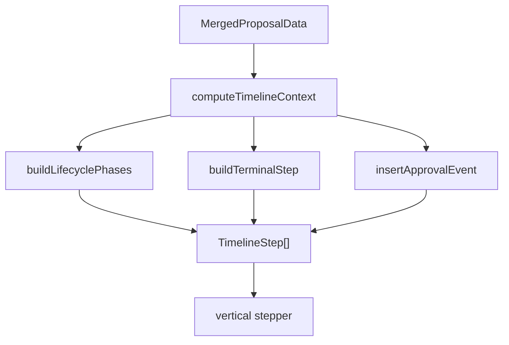
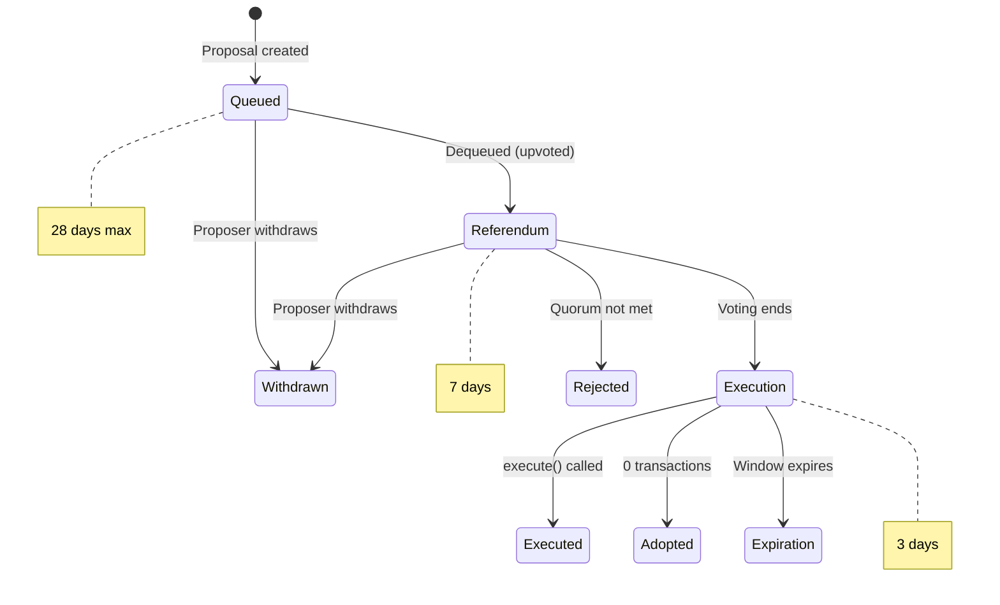
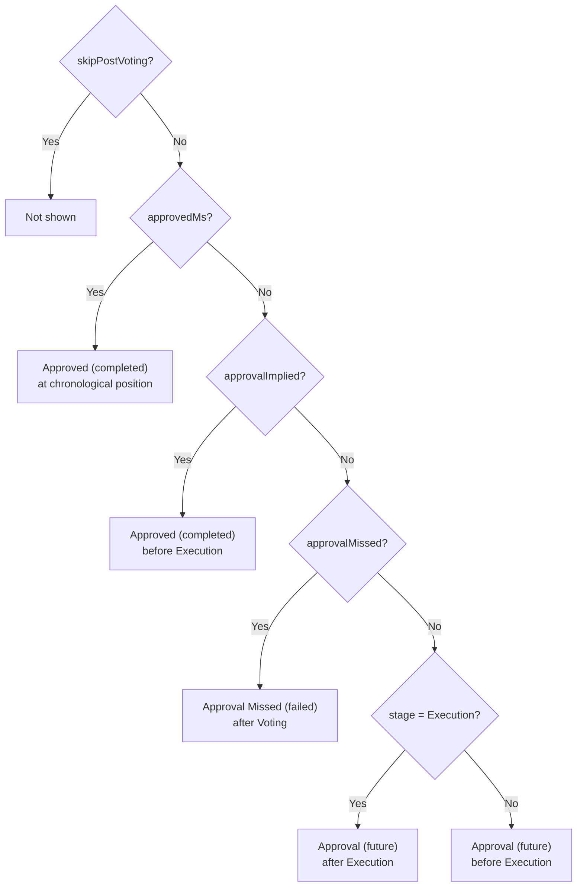

# Proposal Timeline Component

The `ProposalTimeline` component displays a vertical timeline on the proposal detail page showing the lifecycle phases and events of a governance proposal.

## Architecture

### Files

- **`ProposalTimeline.tsx`** — The timeline component and all its logic
- **`src/utils/time.ts`** — `getUTCDateString()` utility for UTC tooltip display
- **`Proposal.tsx`** — Integration point (renders `<ProposalTimeline />` inside `ProposalChainData`)

### Data Flow



## Concepts

### Phases vs Events

The timeline has two types of steps:

- **Phases** (duration-based): Upvoting, Voting, Execution, Expiration. These have `startTime`/`endTime` and represent time windows. Rendered with a larger dot (12px) and bold text.
- **Events** (point-in-time): Approved, Executed, Adopted, Rejected, Withdrawn, Expired, Approval Missed. These have a `timestamp` and `isEvent: true`. Rendered with a smaller dot (6px), italic text, and inline timestamp.

### Step Statuses

| Status      | Dot Color            | Text Color | Meaning                                             |
| ----------- | -------------------- | ---------- | --------------------------------------------------- |
| `completed` | green-500            | green-700  | Phase/event has completed successfully              |
| `active`    | purple-300 (pulsing) | purple-500 | Currently in this phase                             |
| `future`    | taupe-300            | taupe-400  | Not yet reached                                     |
| `failed`    | red-500              | red-500    | Failed outcome (Rejected, Expired, Approval Missed) |

## Lifecycle Order

Phases are always built in this fixed order:

```
1. Upvoting     (queuedAt → queuedAt + 28 days)
2. Voting       (dequeuedAt → dequeuedAt + 7 days)
3. Execution    (dequeuedAt + 7d → dequeuedAt + 10d)
4. Terminal     (Executed/Adopted/Rejected/Withdrawn/Expired/Expiration)
```



> **Note:** The durations above reflect the on-chain governance parameters on Celo mainnet:
> `queueExpiry` (28 days), `stageDurations.referendum` (7 days), `stageDurations.execution`
> (3 days). These are configurable via governance proposals and could change. See
> `Governance.getProposalDequeuedStage()` for the authoritative stage transition logic.

The **Approval** event is then inserted into this list based on context:

| Scenario                                                 | Approval Position                   | Status      |
| -------------------------------------------------------- | ----------------------------------- | ----------- |
| Has `approvedAt` timestamp                               | Chronological position among phases | `completed` |
| Implied (Execution/Executed/Adopted stage, no timestamp) | Before Execution                    | `completed` |
| Missed (Expired + no approval + has transactions)        | After Voting                        | `failed`    |
| Pending, proposal in Voting or Queued                    | Before Execution                    | `future`    |
| Pending, proposal in Execution phase                     | Within Execution                    | `future`    |
| Rejected or Withdrawn                                    | Not shown                           | —           |



> **Note:** On-chain, there is no separate Approval stage. The `approve()` function can be
> called by the approver during **either** the Referendum (Voting) or Execution stages
> (`Governance.sol:471-473`). Approval is a prerequisite for calling `execute()`, so it
> must happen _within_ the Execution window at the latest — not after it.

## Phase Skipping Rules

Not all phases appear for every proposal:

| Condition                                  | Phases Skipped      |
| ------------------------------------------ | ------------------- |
| Rejected (quorum not met)                  | Approval, Execution |
| Withdrawn                                  | Approval, Execution |
| Approval Missed (expired without approval) | Execution           |
| Adopted (0 transactions)                   | Execution           |

## Timestamp Fallbacks

When `dequeuedAt` is missing from the DB (common for older proposals), the component back-calculates it:

```
inferredDequeuedMs = executedAt - 7 days - 3 days    (if executedAt exists)
                   = approvedAt - 7 days              (if approvedAt exists)
```

This allows all phase boundaries to be computed even from partial data.

> **Caveat:** The `approvedAt` fallback assumes approval happened at the end of the
> Referendum stage. In practice, the contract allows approval during both Referendum and
> Execution stages, so `approvedAt` could be anywhere from 0 to 10 days after dequeue.
> This makes the `approvedAt`-based inference a rough approximation.

### Upvoting End Time

- **Active (Queued):** Shows the 28-day max expiry (`queuedAt + 28d`)
- **Completed:** Uses `dequeuedAt` (actual dequeue time) if available, otherwise the 28-day max

### Active Countdown

For the currently active phase, a countdown is shown:

- **Upvoting:** "Expires in X days" / "Expired <date>"
- **Voting/Execution:** "Ends in X days" / "Ended <date>"

## Tooltip

All timestamps display in local timezone via `getFullDateHumanDateString()`. Hovering shows UTC time via a DaisyUI tooltip using `getUTCDateString()`.

## Example Timelines

### Active Voting Proposal

```
● Upvoting              (completed, green)
  Mon, Jan 06, 12:00 GMT
● Voting                (active, purple, pulsing)
  Thu, Feb 05, 16:47 GMT
  Ends in 3 days
· Approval              (future, grey, italic)
● Execution             (future, grey)
● Expiration            (future, grey)
```

### Successfully Executed

```
● Upvoting              (completed, green)
  Sat, Nov 22, 07:06 GMT
● Voting                (completed, green)
  Tue, Nov 25, 07:06 GMT
· Approved — Wed, Dec 03  (completed, green, italic)
● Execution             (completed, green)
  Tue, Dec 02, 07:06 GMT
· Executed — Fri, Dec 05  (completed, green, italic)
```

### Rejected (Quorum Not Met)

```
● Upvoting              (completed, green)
● Voting                (completed, green)
· Rejected — Thu, Oct 23 (failed, red, italic)
```

### Expired (Approval Missed)

```
● Upvoting              (completed, green)
● Voting                (completed, green)
· Approval Missed       (failed, red, italic)
· Expired — Thu, Nov 05  (failed, red, italic)
```

### Queued (Upvoting Active, Expired)

```
● Upvoting              (active, purple, pulsing)
  Wed, Dec 17, 07:06 GMT
  Expired Wed, Jan 14, 07:06 GMT
● Voting                (future, grey)
● Execution             (future, grey)
● Expiration            (future, grey)
```
